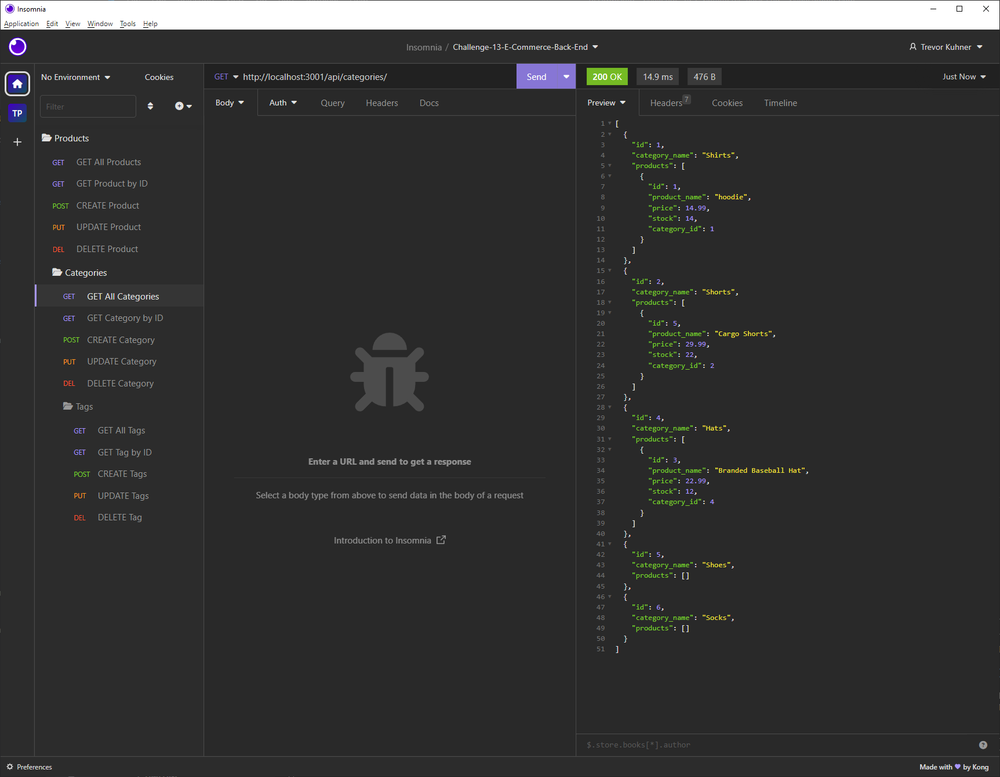

# E-Commerce-Backend
The challenge is to build the back end for an e-commerce site.

## Table Of Content
* [General Info](#general-info)
* [Technologies](#technologies)
* [Installation](#installation)
* [Usage](#usage)
* [License](#license)


## General Info

Program is a demonstration of a hypothetical backend for an e-commerce site. The goal of this program is to focus on data handling and manipulation with a relational database. The program uses MySQL2 and Sequelize to connect to a MySQL database and perform CRUD operations. The CRUD operations are specifially performed inside Insomnia core. The program also uses dotenv to store sensitive data such as the MySQL username and password. The program also uses nodemon to automatically restart the server when changes are made to the code.




## Technologies
* [Javascript](https://www.javascript.com/)
* [Node.js](https://nodejs.org/en/)
* [Sequelize](https://www.npmjs.com/package/sequelize)
* [Insomnia](https://insomnia.rest/)
* [Nodemon](https://www.npmjs.com/package/nodemon)
* [MySQL2](https://www.npmjs.com/package/mysql2)
* [Express](https://www.npmjs.com/package/express)
* [Dotenv](https://www.npmjs.com/package/dotenv)

## Installation
To get started clone this repository using 

```terminal
git clone https://github.com/TKuhner/Challenge-13-E-Commerce-Back-End.git
```
Both Node.js and MySQL must be installed on your computer.

Install dependencies 
```terminal
npm i
``` 

Open up MySQL shell and input 

```terminal
source ./db/schema.sql
```

Then quit the MySQL shell.

Next, open up the .env.EXAMPLE file and input your MySQL username and password.
Then rename the file to .env.

Finally, input the following in your terminal.
```terminal
npm run seed
```
to start running application simply input 
```terminal
nodemon start
```
Open Insomnia core to run GET, POST, PUT and DELETE routes.

## Usage
The application is used to GET data for each route(categories, products, or tags) as well as create, update, and delete data in those routes.

## License
[](https://opensource.org/licenses/MIT)
