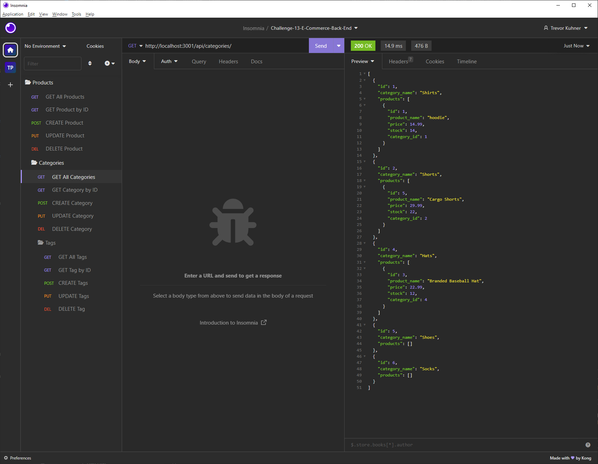

# e-commerce-back-end


## Description


- The goal for this project was to learn as much about back-end routing as we could by taking starter code of an e-commerce site and build out the control flow of data. 

 - This involves verifying that the API endpoints are functioning correctly, and that data can be retrieved, updated, and deleted from the database using the ORM. 


- We used node.js to run the server, sequelize to connect to our database, express to set up the server, and dotenv to hide our password and username for our database.
- We also used Insomnia to test our API routes and make sure they were working correctly.
- See below for a video of the application in action!


<!-- 
Provide a short description explaining the what, why, and how of your project. Use the following questions as a guide:

- What was your motivation?
- Why did you build this project? (Note: the answer is not "Because it was a homework assignment.")
- What problem does it solve?
- What did you learn? -->

## Table of Contents (Optional)

If your README is long, add a table of contents to make it easy for users to find what they need.

- [e-commerce-back-end](#e-commerce-back-end)
  - [Description](#description)
  - [Table of Contents (Optional)](#table-of-contents-optional)
  - [Installation](#installation)
  - [Usage](#usage)
  - [License](#license)
  - [Badges](#badges)
  - [Features](#features)
  - [How to Contribute](#how-to-contribute)
  - [Tests](#tests)

## Installation
<!-- 
What are the steps required to install your project? Provide a step-by-step description of how to get the development environment running. -->
1. Clone the repo to your local machine using `git clone directory_name`
2. ```npm install``` to install all dependencies
3. run mysql -u root -p and enter your password to log into mysql
4. run ```source db/schema.sql``` to create the database
5. run ```npm run seed``` to seed the database
6. openthe .env.EXAMPLE file and input your MySQL username and password.  - ```vim .env.EXAMPLE``` to open the file and then run ```:wq``` to save and exit and then rename the file to .env
7. Finally, input the following in your terminal. ```terminal npm run seed```
to start running application simply input 

```terminal
nodemon start
```
8. Open Insomnia core to run GET, POST, PUT and DELETE routes.


---

## Usage




### Demo Video
[walkhtrough-video](https://drive.google.com/file/d/1tLFJ1A-TpsYj8vpFS4V_ASQabPIv7McG/view?usp=sharing)

<!-- ## Credits

List your collaborators, if any, with links to their GitHub profiles.

If you used any third-party assets that require attribution, list the creators with links to their primary web presence in this section.

If you followed tutorials, include links to those here as well. -->

## License
<!-- 
The last section of a high-quality README file is the license. This lets other developers know what they can and cannot do with your project. If you need help choosing a license, refer to [https://choosealicense.com/](https://choosealicense.com/). -->
- MIT License
---

🏆

## Badges


## Features

If your project has a lot of features, list them here.

## How to Contribute

- Feel free to fork and make pull requests.
- Contact me if you have any questions after viewing the video


## Tests
- No tests were used for this project (yet)

